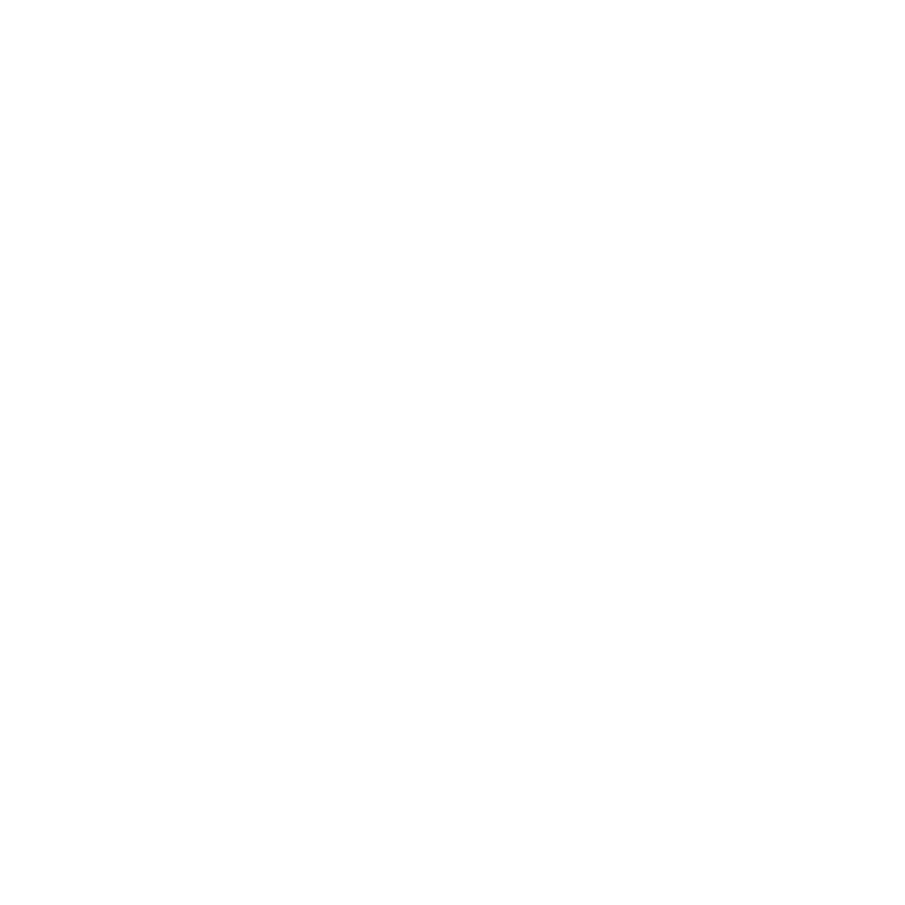
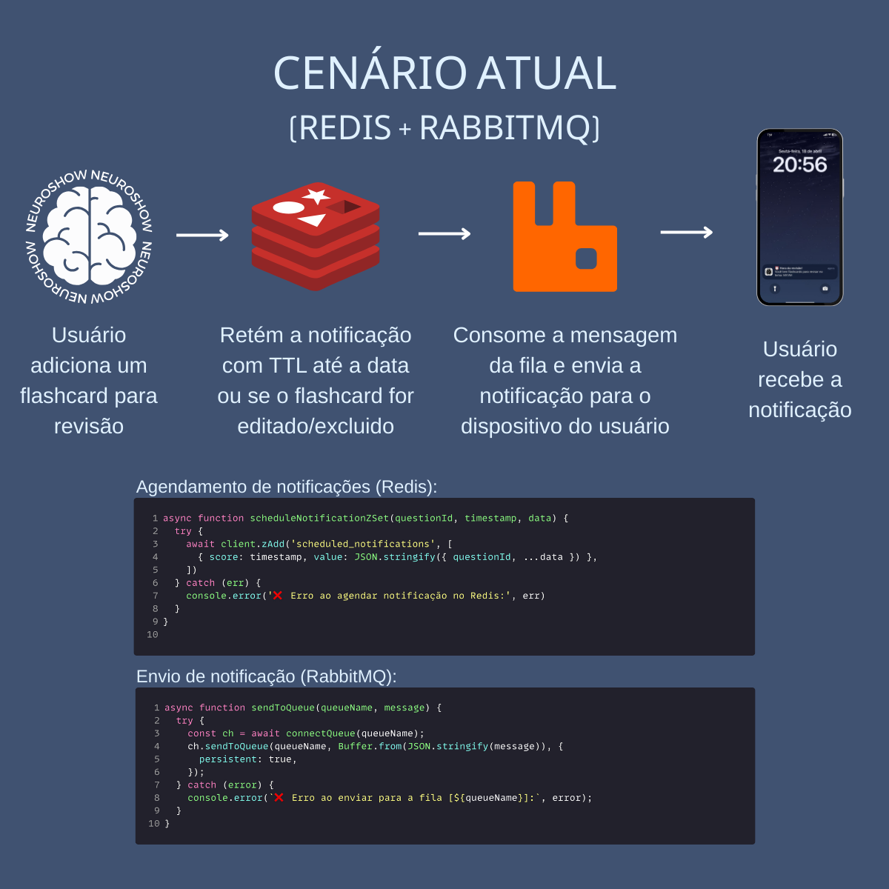

# Neuroshow Platform

  

  
  
  
  
  
  
  
  
  

  
  

  or access at: <a href="https://neuroshow.com.br" target="_blank"><strong>neuroshow.com.br</strong></a>

---

**Description:**  
Neuroshow is an educational platform designed to enhance learning through flashcards and quizzes with a spaced repetition system.  
Users can create flashcards with images, assign difficulty levels, and receive mobile notifications to review content at optimal intervals for memory retention.

This project was developed during my undergraduate studies in Production Engineering at the **Federal University of Paraíba (UFPB)**, in collaboration with the research group **NESMEP (Núcleo de Estudos em Saúde Mental e Psicometria)**.  
Learn more about NESMEP [on Instagram](https://www.instagram.com/nesmep.ufpb/).

---

**Difficulty-based review logic:**

- **Hard:** review notification after 1 day
- **Medium:** after 3 days
- **Easy:** after 5 days

Notifications are sent directly to the user's mobile device, promoting efficient memory consolidation over time.

## Technologies used

**Web Platform:**

- **Frontend:** React.js + TailwindCSS
- **Backend:** Node.js
- **Database:** Firebase Firestore

**Mobile Applications:**

- **Android:** Kotlin with WebView integration
- **iOS:** Swift with WebView integration

**Messaging and Notifications:**

- **Cloud Messaging:** Firebase Cloud Messaging (FCM)
- **Real-time Scheduling:** Redis for temporary storage and RabbitMQ for asynchronous message dispatch to FCM tokens.

## My Contributions

- Developed the fullstack web application using React.js, TailwindCSS, and Node.js.
- Built the mobile applications for Android (Kotlin) and iOS (Swift) using WebView integration for seamless web experience.
- Designed and implemented the cloud notification system based on Redis and RabbitMQ to handle scheduled flashcard reviews.
- Integrated Firebase Authentication, Firestore Database, and Firebase Cloud Messaging (FCM) for user management and push notifications.
- Created difficulty-based spaced repetition algorithms to enhance learning efficiency.

## Deployment and Infrastructure

- The web application and backend services are deployed on a **Linux VPS**.
- **Nginx** is used as a reverse proxy and for SSL termination.
- **PM2** is used to manage Node.js backend processes with auto-restart and log monitoring.
- Database and cloud messaging services are handled by **Firebase**.

## Notification System Architecture

The flashcard review notifications are handled using a combination of Redis and RabbitMQ:

  

- Redis stores scheduled notifications.
- RabbitMQ dispatches them to Firebase Cloud Messaging (FCM) when the time is right.

## Private Repository Notice

Due to confidentiality agreements and project privacy, the full source code of Neuroshow cannot be shared publicly.  
Please feel free to contact me for more information during interviews.
